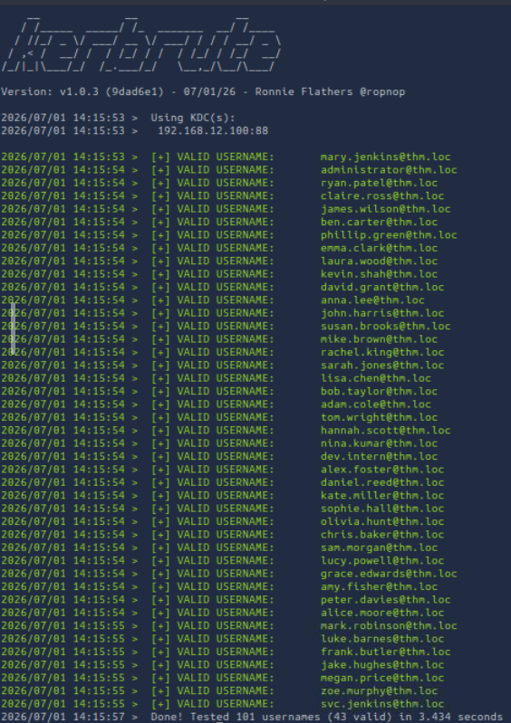
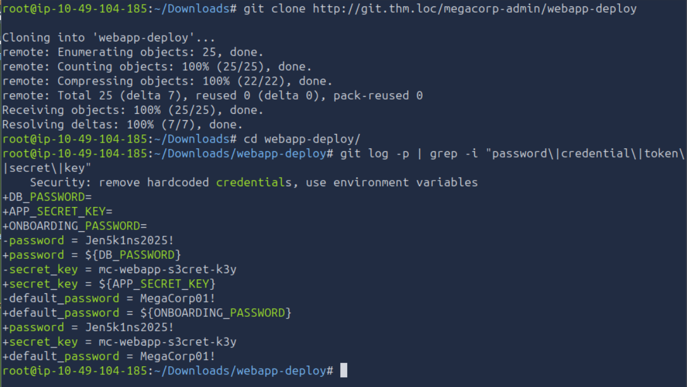
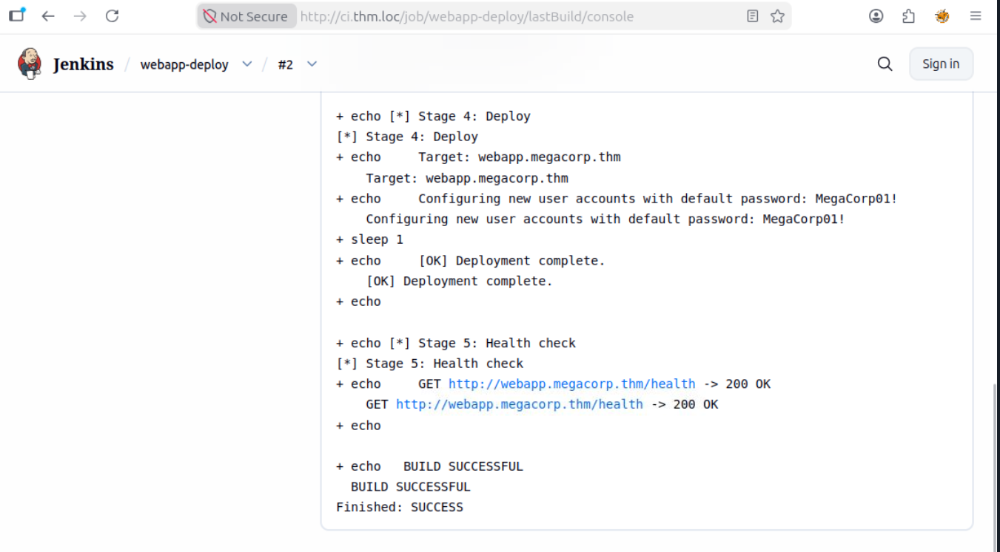
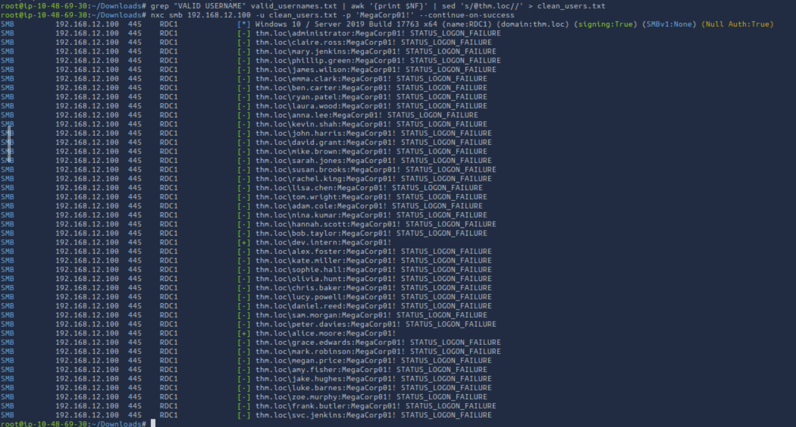
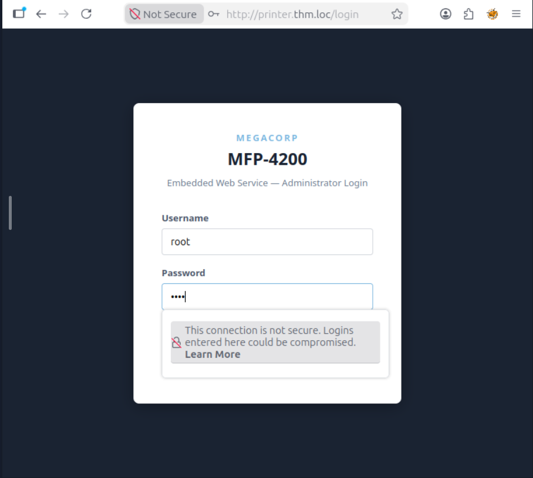
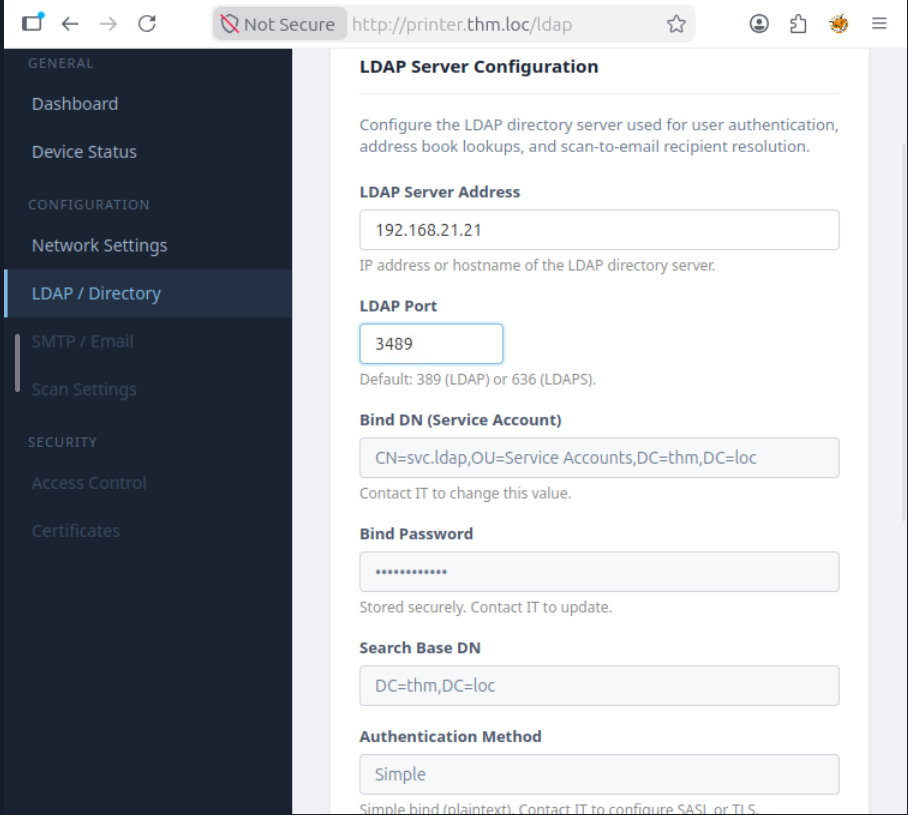
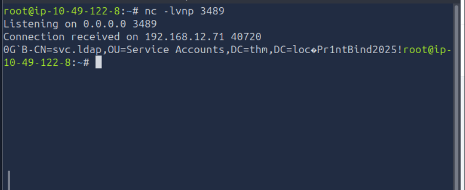
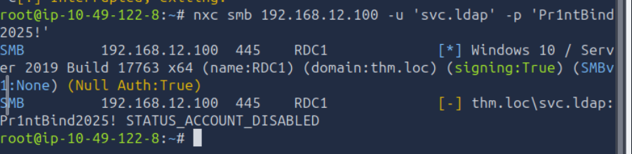

# What is Active Directory?
Active Directory is a service launched by Windows Server 2000, with its main focus of authentication and authorization to users on the network. 

Read More about it [here](https://activedirectorypro.com/what-is-active-directory/)
# Try Hack Me Room
In this blog we will walk through and understand [Intro to AD Breaching](https://tryhackme.com/room/introductiontoactivedirectorybreaching)
## Task 1: Introduction
This task introduces that the first set of valid credentials is required to begin enumeration or move laterally or escalate privileges. Process of obtaining those initial credentials is called *breaching*.

Let's connect to the network first.
- Method 1: AttackBox. Simply click on the "Start AttackBox" button at the top. 
- Method 2: OpenVPN connection. Connect to the network using the VPN profile file created. 

The machines are connected to the network via VPN in either of the case. To ensure name resolution we perform the following command `sudo nano /etc/hosts`.
And then we add the following:
```
192.168.12.100  thm.loc 
192.168.12.71   git.thm.loc ci.thm.loc printer.thm.loc 
192.168.12.51   SERVER1.thm.loc
```

Once this is done. Our AttackBox is ready to breach into the Active Directory.

## Task 2: Active Directory Breaches
This task talks about what is Active Directory Breaching and the AD attack surface.

A typical AD environment exposes a range of target-able services and protocols during the breaching phase.

* SMB(TCP 445) : File sharing, printers and remote administration.
* LDAP(TCP 389/636) : Misconfigured devices often store LDAP credentials.
* HTTP/HTTPS : Web-based services.
* Kerberos(TCP/UDP 88) : Domain's primary authentication protocol.
* DNS(TCP/UDP 53) : Used to resolve hostnames within AD environment.

## Task 3: OSINT and Target Reconnaissance
In this task we move towards finding valid usernames. We do so by enumerating usernames through Kerberos, as it does not trigger account lockouts. A wordlist is saved into /root/usernames.txt, as given by the THM. 

The wordlist can also be created manually using various techniques and sources.

*Step 1*: Install Kerbrute 
Go to `https://github.com/ropnop/kerbrute/releases/tag/v1.0.3` and install the appropriate version

Go to Downloads and make the module executable. `chmod +x kerbrute_linux_amd64`
and finally for easy usage move it using `mv kerbrute_linux_amd64 kerbrute`

*Step 2*: Enumerate the wordlist on the AD domain controller.
`kerbrute userenum -d thm.loc --dc 192.168.12.100 \root\usernames.txt`

It displays all the valid usernames.


## Task 4: Credential Discovery
Task talks about several places that where developers and administrators accidentally, such as Git Repositories, CI/CD platforms and file shares. 

### Hunting Credential in Git Repositories
The task has provided us with an exposed [Github Repository](http://git.thm.loc/megacorp-admin/webapp-deploy)
However, in real scenarios, we have to find the exposed repositories by simply searching companies name in Github.

On finding the repositories we use `git log` to look for password/credentials.


Jen5k1ns2025! is the retrieved password.
mc-webapp-s3cret-k3y is the secret key.
MegaCorp01! is the default password.

### Hunting Credentials in Jenkins
Jenkins is a common CI/CD platform on internal network, where credentials are often left. 

Hunting through the Jenkins web interface we further find the default password in console output


## Task 5: Password Spraying
In this approach we try a single password against many accounts.

NetExec tool is used to perform spraying of the passwords we retrieved in the previous task on the valid usernames we retrieved in Task 3.



The above shows that 'MegaCorp01!' is the password for accounts 'alice.moore' and 'dev.intern', i.e.; Alice Moore and Developer Intern, has kept the default password. Hence, we have attained a valid credential pair.

## Task 6: Coercion Attack 
Coercion tricks a device or user into sending authentication material to an attacker-controlled listener.

In this we experience two techniques LDAP passback attack and a file based Coercion.

### LDAP Passback Attack.
Network devices like printer, scanners and multifunction peripherals integrate with Active Directory via LDAP. For this to work, the device stores a set of LDAP credential.

*Step 1*: Go to the printer application's web admin portal and login using admin:admin


*Step 2*: Go to LDAP settings and set Server Address as lan0 of attackbox and LDAP port as 3489
And save changes


*Step 3* Choose test connection and run `nc -lvnp 348`


*Step 4*: Once we receive the LDAP Password as 'Pr1ntBind2025!', we use it to verify in NetExec


\[-\] indicates that the account has been disabled.
Hence, we move to the next type of Coercion attack, File-Based Coercion.

### File Based Coercion Attack


